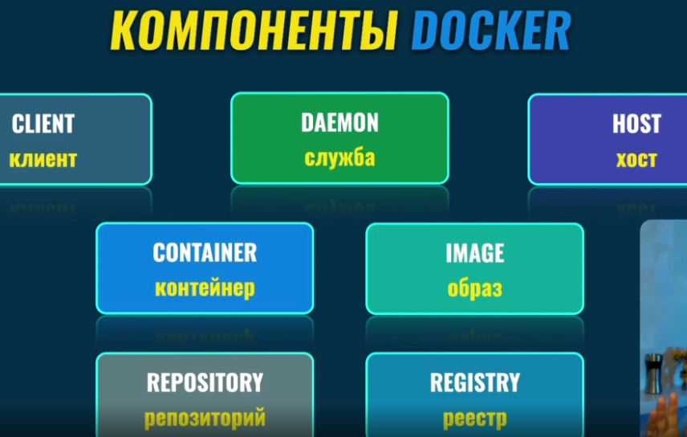
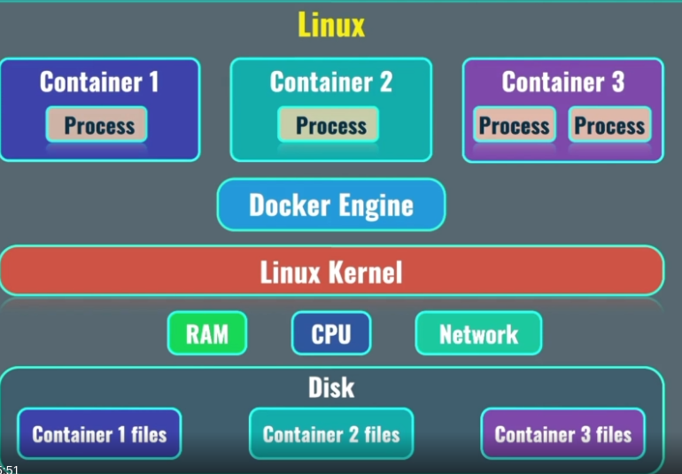

# Устройство



# Устройство изнутри

Есть виртуальная машина. Под управлением ядра `linux kernel`
Которая имеет свой доступ по сети. Память и ресурсы процессора.

Для того чтобы создавать контейнеры нам необходим
`docker engine` -> который запускает сервис `DAEMON`



# Сначала ставим docker

    Переходим на оффициальный сайт
    https://www.docker.com/

## Если linux -> docker engine

## Если Windows MacOs -> docker desktop

## Устанавливаем расширение docker в VSCode

### После установки

Пишем команду:

    docker --version
g
Если видим ошибку:

    Got permission denied while trying to connect to the docker daemon socket at unix:///var/run/docker.sock: get http://%2fvar%2frun%2fdocker.sock/v1.24/version: dial unix /var/run/docker.sock: connect: permission denied

Исполняем команду:

    sudo chmod 666 /var/run/docker.sock

И потом опять:

    docker --version

Если ошибка сохранилась, то:
https://stacktuts.com/got-permission-denied-while-trying-to-connect-to-the-docker-daemon-socket-at-unix-var-run-docker-sock-get-http-2fvar-2frun-2fdocker-sock-v1-24-version-dial-unix-var-run-docker-sock-connect-permission-denied

### Узнаем список запущенных или остановленных контейнеров

    docker ps -a

Или запущенных контейнеров

    docker ps

### Посмотреть список всех образов

    docker images

### Удалить все остановленные контейнеры

    docker container prune

### Удалить контейнер по id или Имени

    docker rm d8b62b8b755b

### Запустить контейнер в фоновом режиме

    docker run -d nginx

### Запустить контейнер в фоновом режиме и дать ему имя

    docker run -d --name my_nginx nginx

### Посмотреть информацию о запущенном контейнере

И если нам нужен IPAdress то выполняем grep

    docker container inspect ff8243d3f27d | grep IP

### Запустить контейнер и войти в него

    docker run -it busybox

либо

    docker run -i -t busybox

`it` -> iteractive terminal

### Остановить контейнер

Вставить имя или id

    docker stop ff8243d3f27d
    docker stop angry_perlman

### Остановить контейнер моментально

    docker kill angry_perlman

## Запуск дополнительного процесса

    docker exec -it 311c5a02feeb bash

`exec` -> выполняемт команду в запущенном контейнере\
`it` -> опция интерактивного терминала\
`311c5a02feeb` -> id или Имя контейнера\
`bash` -> название процесса

Пример:

    docker exec -it 15d7f5724280 bash
    cd /usr/share/nginx/html/
    cat index.html

###

### Просмотр файлов в папке

Всех:
`ls -la`

Только видимых:
`ls`

## Запуск контейнера на внешнем порту 8080

### Maping портов

    docker run -d -p 8080:80 nginx
    docker run -d -p 8081:80 nginx

### Maping томов

    docker run -d -v ${PWD}:/usr/share/nginx/html nginx

`-v` -> подключение тома

`${PWD} `-> показывает абсолютный путь к локальной папке\
`echo ${PWD}` -> увидим абсолютный путь в консоли

## Запуск и удаление контейнера после его остановки.

    docker run -it --rm busybox

`-it` -> interactive terminal\
`--rm` -> удаление контейна после остановки

## Рекомендация разбивать команду на строки

```
docker run \
    -d \
    -p 8081:80 \
    --rm \
    -v ${PWD}:/usr/share/nginx/html \
    --name my-nginx \
    nginx
```

# Cоздание образов

Создаем тогда, когда не можем найти нужный образ на docker hub или создаем приложение.

Создаем dockerfile в корне
При создании образа необходимо указать `имя` и `тег`

Запуск процесса создания образа:

    docker build .

`build` -> запуск процесса\
`.` -> путь к Dockerfile

    docker build . -t my-calendar:4.1.3

`-t` -> добавление имени и тега для образа\
`my-calendar` -> название образа\
`4.1.3` -> Опциональный тэг

Если не указать опциональный тэг, будет создал тег `latest`

# Различие между императивным и декларативным подходами

## Имеративный

когда мы даем docker'y инструкция для выполнения каждого действия

## Декларативный подход

Вы как бы говорите:

> Я хочу чтобы было запущено столько-то контейнеров, в этом контейнере должно быть запущено такое-то приложение, такие-то порты должны быть открыты.

В этом подходе мы абстрагируемся от команд. А описываем инструкции с помощью `.yaml` файла.

## Формат YAML файла

Cписок:

```
fruits:
    - banana
    - apple
    - orange
```

Словарь:

```
pen:
    color: yellow
    model:
        type: pen
        material: plastic
    price: 2
```

# Создание нескольких контейнеров с помощью docker-compose.yml

Когда мы сформировали yaml файл
Используем команды для поднятия контейнера
и для того чтобы удалить контейнеры после использования.

    docker compose up
    docker compose down

Запуск контейнера в фоновом режиме.

    docker compose up -d

Когда мы изменили что-то в файле и нам нужно пересобрать контейнер.

    docker compose up -d --build

Чтобы посмотреть логи по конкретному контейнеру необходимо

    docker logs a29cb8085228

# Создание приложения docker+vue+mysql

## DOCKERFILE для fronten'a

```
FROM node:alpine

WORKDIR /app

EXPOSE 3000

COPY package*.json ./

RUN npm install

COPY . ./

CMD ["npm", "run", "dev"]
```

Указание текущей директории внутри образа `./`

В команде COPY мы копируем все файл в текущую директорию

В команде CMD передаем\
`1 - исполняемый файл`  
`2, 3 - параметры`
Команда dev - запустит сервер web разработки с поддрежкой hot reload

## DOCKERFILE для backend'a

```
FROM node:alpine

WORKDIR /app

EXPOSE 5000

COPY package* ./

RUN npm install

COPY . ./

CMD ["npm", "run", "dev"]
```

Команду `CMD ["npm", "run", "dev"]`
исполняет скрипт в `package.json`

```
"scripts": {
    "start": "node index.mjs", // для прода
    "dev": "nodemon index.mjs" // для разработки
}
```

## Создание файла `docker-compose.yml`

Добавление переменных среды

```
mysql:
  image: mysql
  ...
  environment:
      MYSQL_ROOT_PASSWORD: password
      MYSQL_DATABASE: time_db
  ...
```

```
version: '3'

services:
  frontend:
    build: ./frontend
  api:
    build: ./api
  mysql:
    image: mysql
  adminer:
    image: adminer
```

Чтобы посомтреть каие переменные среды

    docker exec -it 9f74e158c6ef sh

Команда

    printenv

Чтобы сначала запустился `depend_on`

```
version: '3'

services:
  frontend:
    build: ./frontend
    restart: always
    ports:
      - '3333:3000'
  api:
    build: ./api
    restart: always
    ports:
      - '5555:5000'
    depends_on:
      - mysql
  mysql:
    image: mysql
    restart: always
    environment:
      MYSQL_ROOT_PASSWORD: password
      MYSQL_DATABASE: time_db
  adminer:
    image: adminer
    restart: always
    ports:
      - '8888:8080'
```

# Том для сохранения данных

# Загрузка на dockerhub

docker build -t olegway/frontend-time-app-dev .
docker login
docker images
docker push oleg olegway/frontend-time-app-dev

# Удаление образов

docker image prune -a

# Поднятие из docker.hub образа

docker compose -f docker-compose.pub.yml up -d
